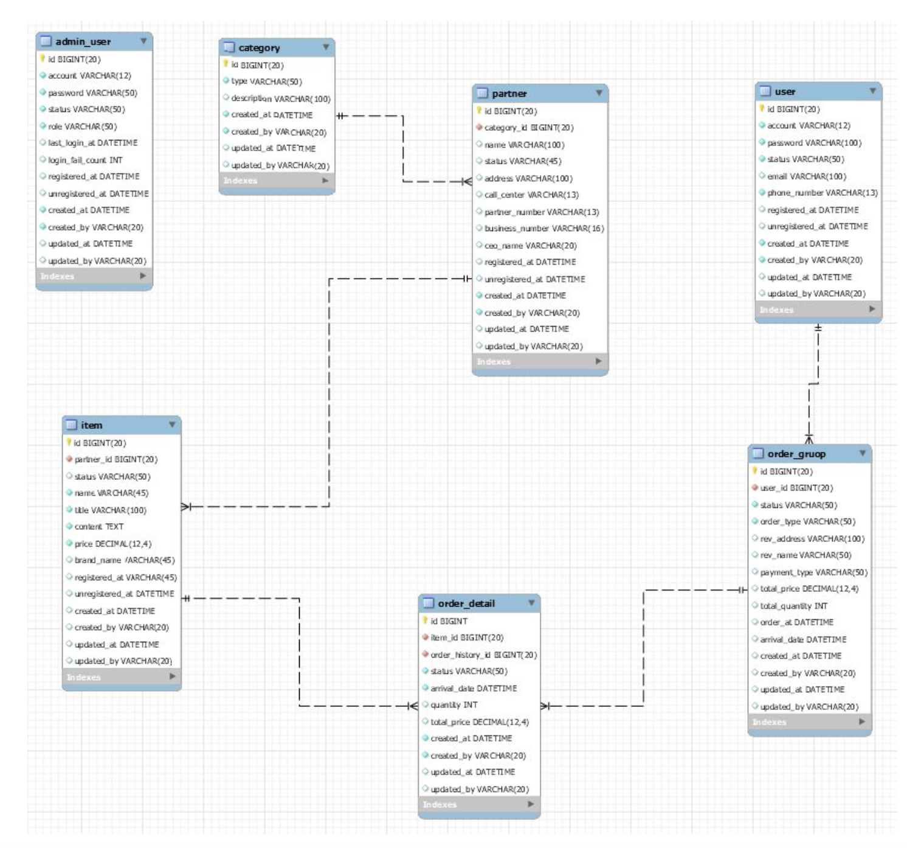

# Admin Project 
관리자가 사용자와 물품 관리를 용이하게 할 수 있는 시스템

## 사용언어, 기술 스택 
- Java SpringBoot 
- MySQL

## 개발 절차 
1. ERD 설계 

1. Table 생성 
    - ### JPA table 간의 관계 설정 
      - 일대일 @OneToOne
      - 일대다 @OneToMany
      - 다대일 @ManyToOne
      - 다대다 @ManyToMany
1. Entity 생성 
1. Repository 생성 
1. Repository 테스트 
1. 연관관계 설정 
1. 필요한 Qeury Method 생성 

## 배운 점 
인터넷 강의를 통해 강사님의 코드를 따라 쳐보면서 Java Spring을 처음 공부해 보는 입장에서 이에 익숙해지는 계기가 되었다.   
통신, Http Method, ERD설계, JPA 등을 다뤄보며 이들의 개념에 대해 이해하고 직접 실습을 해보면서 Backend 개발의 전반을 이해하였다. 