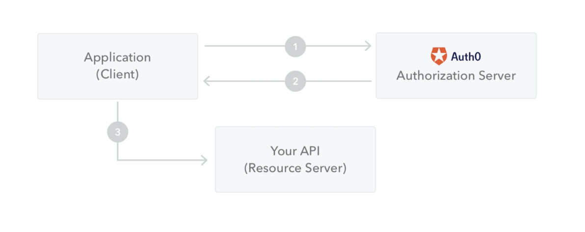

# eatgo project 
Restaurant 예약 관리 시스템 

## 사용언어, 기술 스택 
- Java SpringBoot 
- h2 Database

## 사용자
- 사용자는 Administrator와 Customer로 나뉘고 Customer는 가게 주인과 가게 이용자로 나뉜다. 

## 배운 점 
- __Backend개발__ 은 사용자에게 보이지 않는 부분을 담당해 개발하는 것으로 Server-side 개발이라고도 한다.
- __Rest API__  기술을 통해 백엔드 개발하면서 API개발에 익숙해 지는 계기가 되었다. 
- __Bean__:  애플리케이션의 핵심을 이루는 객제이며 Spring IoC 컨테이너에 의해 인스턴스화, 관리, 생성된다. 
- __Http Status__ 
    - 100 Continue:  지금까지 상태가 괜찮다는 상태 
    - 200 OK: 요청이 성공적으로 되었다. 
    - 201 Created: 요청이 성공적이고 그로 인해 새로운 리소스가 생성되었다.(POST, PUT)
    - 400 Bad Request: 잘못된 문법으로 인해 서버가 요청을 이해할 수 없다. 
    - 404 Not Found: 서버는 요청받은 리소스를 찾을 수 없다. 알려지지 않은 URL을 의미한다.  
                     서버는 인증받지 않은 클라이언트로부터 리소스를 숨기기 위하여 이 응답을 전송하기도 한다. 
    - 405 Method Not Allowed:  요청한 메소드는 서버에서 알고 있지만, 사용할 수 없다. 
    - 500 Internal Server Error:  서버가 처리 방법을 모르는 상황이다. 서버는 처리 방법을 알 수 없다.  
- __Spring initializr__ 을 이용한 project를 경험해 봄으로써 spring boot의 기본을 이해 할 수 있었다. 
- Spring Bean
- __Dependency injection__:  둘 이상의 객체가 서로 협력하는 방법  
    - 객체들이 연결된 관계를 더 유연하게 바 꿀 수 있다.
    - 사용해야 할 객체를 다양하게 변경할 수 있다.  
- __Multi-Project__ 의 이점은 프로젝트를 진행하면서 공통으로 사용하는 코드를 재사용 할 수 있다는 점이다. 
- __TDD__:  목표 주도 개발, 사용자 중심 개발, interfacce 중심 개발 
    - TDD 기반 개발의 이점은 무엇을 만들지 생각해 보고 생각에 대한 스팩을 먼저 테스트 코드로 작성해 통과시키면서 기능을    올바르게 만들고 계속 확장 구현 할 수 있다는 것이다. 
- __Layered Architecture 설계__ 
    - UI Layer 
    - Application Layer
    - Domain Layer 
    - Infrastructure Layer 
-  __Mock Object__: Mock Object를 만들어 Test에 활용하면 test 시간을 줄이면서 불필요한 리소스 소비를 줄일 수 있다. 
    - Mockito에서 지원하는 mock을 사용해 Mock Object를 만들고 만들어진 Mock Object는 Mockito의 verify를 통해 호출여부를 검증한다. 
    - @RunWith(Mockito JUnitRunner.class):  선언한 Mock Object를 test하는 동안 사용할 수 있게 해주는 Annotation
    - @Mock
    - @MockBean
- __JPA__  
    - java에서 제공하는 API로 자바 어플리케이션에서 관계형 데이터베이스를 사용하는 방식을 정의한 인터페이스이다. 
    - java class와 DB테이블을 mapping한다. 
    - 애플리케이션과 JDBD 사이에서 동작하며 JPA 내부에서 JDBC API를 사용하여 DB와 통신하는 것이다. 

- password 같은 중요한 정보들은 DB에 그대로 저장하면 문제가 됨으로 __Spring Security__ 를 사용해 원래 password를 알지 못하게 BCrypc방법으로 처리해야 한다.     
- __JWT(JSON WEB TOKENS)__:  Json format을 이용해 웹에 활용할 수 있는 accessToken을 다루는 표준이다.
    - Header: data가 어떤 타입인지 어떤 algoruthm을 가지고 있는지 등이 들어가 있다. 
    - Payload: 실제 사용할 data가 들어가 있다.
    - Signature: data를 일정하게 hadshing하고 hashing된 data를 암호화해서 값이 나중에 검증될 때 바뀌지 않았음을 증명하는 방식으로 활용된다. 
    

    - 사용자가 로그인을 하면, 서버는 사용자의 정보를 기반으로한 토큰을 발급한다.
    - 사용자가 서버에 요청을 할 때 마다 JWT를 포함하여 전달하고 서버는 요청한 작업에 사용자가 권한이 있는지 확인하여 작업을 처리 
    - BasicAuthenticatioFilter를 활용해 모든 요청에 대해 JWT token이 setting 됐는지를 확인한다.
    - AuthenticationToken 객체를 활용해 지금 어떤 사용자가 사용 중 인지 확인한다.
- __Validation__:  사용자들이 이용하는 data가 올바른지 인증하는 작업으로 올바르지 않으면 Error를 내보내야 한다. 
    - @Valid:  Spring이 알아서 유효성 검사를 도와주는 Annotation
    - @ControllerAdvice:  예외를 던지고 예외를 처리하게 하는 Annotation 
